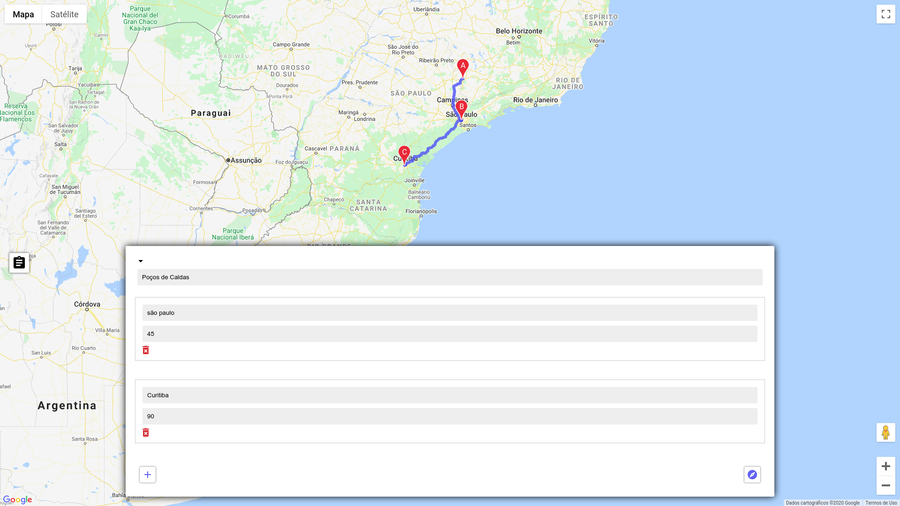
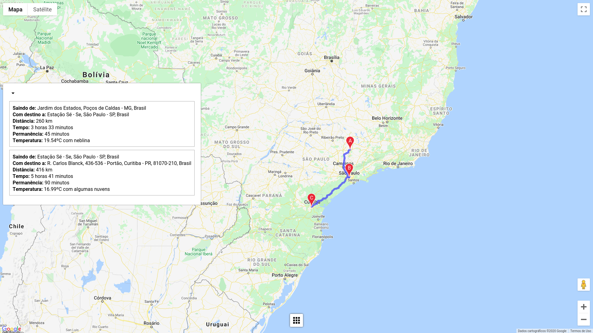

<h1 align="center">Road Trip Planner</h1>

A web application that allows users to plan a
road trip by adding stopping points. The app shows to the user the
weather forecast for each location in the specified period.
The was developed using ReactJs.

## Preview
The components are collapsable what makes the use less confuse and appropriate to small screens. The first screen shows a route for three brazilian cities.

The second screen displays the details for the user's trip.

## Available Scripts

This project was bootstrapped with [Create React App](https://github.com/facebook/create-react-app).

In the project directory, you can run:

### `yarn start`

Runs the app in the development mode. 
Open [http://localhost:3000](http://localhost:3000) to view it in the browser.

The page will reload if you make edits. 
You will also see any lint errors in the console.

### `yarn test`

Launches the test runner in the interactive watch mode. 
See the section about [running tests](https://facebook.github.io/create-react-app/docs/running-tests) for more information.

### `yarn build`

Builds the app for production to the `build` folder. 
It correctly bundles React in production mode and optimizes the build for the best performance.

The build is minified and the filenames include the hashes. 
Your app is ready to be deployed!

See the section about [deployment](https://facebook.github.io/create-react-app/docs/deployment) for more information.

### `yarn eject`

**Note: this is a one-way operation. Once you `eject`, you can’t go back!**

If you aren’t satisfied with the build tool and configuration choices, you can `eject` at any time. This command will remove the single build dependency from your project.

Instead, it will copy all the configuration files and the transitive dependencies (webpack, Babel, ESLint, etc) right into your project so you have full control over them. All of the commands except `eject` will still work, but they will point to the copied scripts so you can tweak them. At this point you’re on your own.

You don’t have to ever use `eject`. The curated feature set is suitable for small and middle deployments, and you shouldn’t feel obligated to use this feature. However we understand that this tool wouldn’t be useful if you couldn’t customize it when you are ready for it.

## Learn More

You can learn more in the [Create React App documentation](https://facebook.github.io/create-react-app/docs/getting-started).

To learn React, check out the [React documentation](https://reactjs.org/).

### Code Splitting

This section has moved here: https://facebook.github.io/create-react-app/docs/code-splitting

### Analyzing the Bundle Size

This section has moved here: https://facebook.github.io/create-react-app/docs/analyzing-the-bundle-size

### Making a Progressive Web App

This section has moved here: https://facebook.github.io/create-react-app/docs/making-a-progressive-web-app

### Advanced Configuration

This section has moved here: https://facebook.github.io/create-react-app/docs/advanced-configuration

### Deployment

This section has moved here: https://facebook.github.io/create-react-app/docs/deployment

### `yarn build` fails to minify

This section has moved here: https://facebook.github.io/create-react-app/docs/troubleshooting#npm-run-build-fails-to-minify

## Built With

* [Node](https://nodejs.org/en/) - JavaScript runtime built on Chrome's V8 JavaScript engine
* [npm](https://www.npmjs.com/get-npm) - The package Manager
* [React](https://reactjs.org/docs/getting-started.html) - React is a JavaScript library for building user interfaces. Learn what React is all about on our homepage or in the tutorial.
* [Google Geocoding Api](https://developers.google.com/maps/documentation/geocoding/start) - The Geocoding API is a service that provides geocoding and reverse geocoding of addresses.
* [Google Matrix Distance Api](https://developers.google.com/maps/documentation/distance-matrix/overview) - The Distance Matrix API is a service that provides travel distance and time for a matrix of origins and destinations. The API returns information based on the recommended route between start and end points, as calculated by the Google Maps API, and consists of rows containing duration and distance values for each pair.
* [Open Weather](https://openweathermap.org/current) - Access current weather data for any location on Earth including over 200,000 cities! Current weather is frequently updated based on global models and data from more than 40,000 weather stations. Data is available in JSON, XML, or HTML format.

<!-- LICENSE -->
## License

This project is NOT licensend, it means that rights are reserved and it is not Open Source or Free. You cannot modify or redistribute this code without explicit permission from the copyright holder.

<!-- CONTACT -->
## Contact

Cefas Garcia Pereira - [ LinkedIn](https://www.linkedin.com/in/cefas-garcia-pereira-bbaaa080/) &nbsp; - [ GitHub](https://github.com/cefasgarciapereira) - [cefas.me](https://cefas.me) - cefasgarciapereira@gmail.com 
